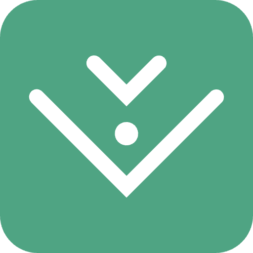
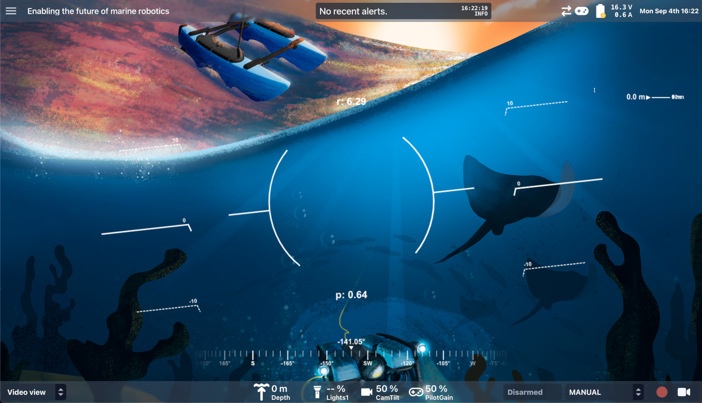
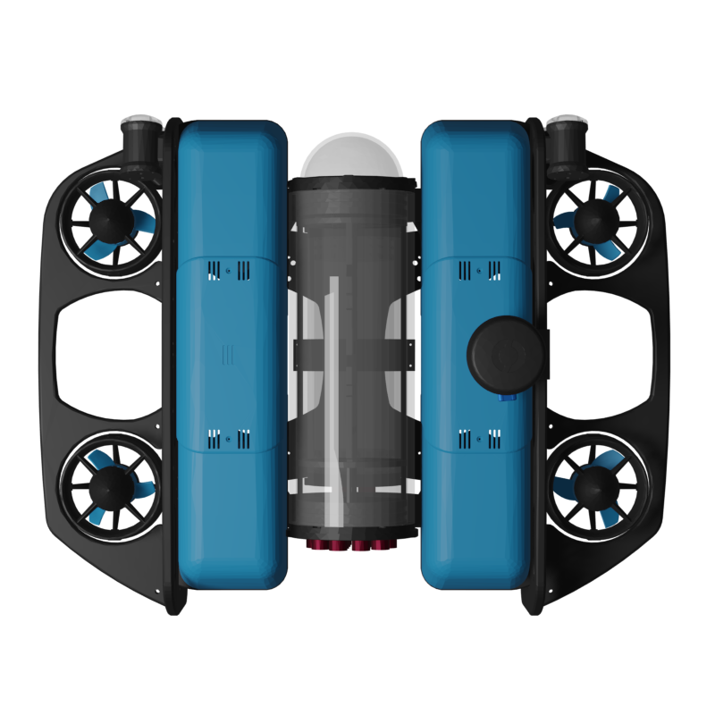
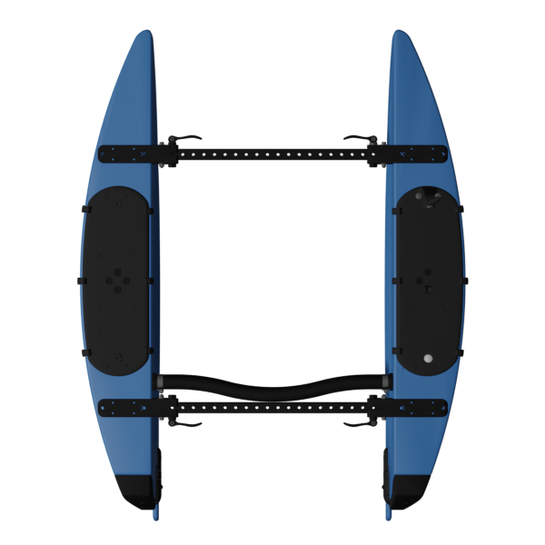
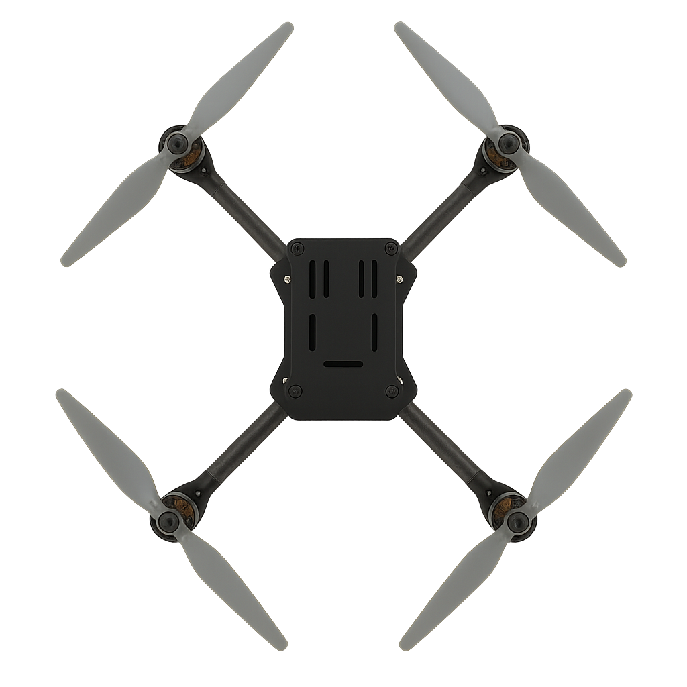
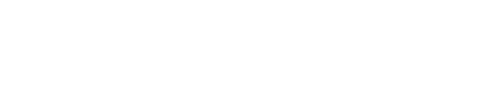

<div align="center">
  <br>
</div>

<div align="center">
  <h1>Cockpit - A Modern Ground Control Software</h1>

  <p>
    <a href="https://docs.bluerobotics.com/cockpit">🌐 Live Demo</a> •
    <a href="https://blueos.cloud/cockpit/docs/latest/usage/installation/">📦 Install</a> •
    <a href="https://blueos.cloud/cockpit/docs">📖 Documentation</a> •
    <a href="https://discuss.bluerobotics.com/c/bluerobotics-software/cockpit">💬 Community</a>
  </p>
</div>

<br>

<div align="center">
  <br>
</div>

<br>

[](https://github.com/bluerobotics/cockpit/actions/workflows/ci.yml)

[](https://github.com/bluerobotics/cockpit/releases)
[](https://hub.docker.com/r/bluerobotics/cockpit/tags)

---

## 🎯 What is Cockpit?

  <p><strong>An intuitive, customizable, and powerful ground control station software for remote vehicles of all types</strong></p>

Cockpit is a web-based ground control station that aims improve how you interact with remote vehicles. Whether you're piloting underwater ROVs, surface boats, aerial drones or ground rovers, Cockpit provides an intuitive and highly customizable interface that adapts to your needs.

### ✨ Key Highlights

- **🌐 Universal Platform**: Runs in your browser or as a native desktop application
- **🎨 Fully Customizable**: Drag-and-drop widget interface that adapts to your workflow
- **🚀 Multi-Vehicle Support**: Control submarines, boats, drones and rovers from different interfaces in the same application
- **📹 Advanced Video**: Support for as many video streams as you need, with recording, snapshots, and real-time statistics
- **🗺️ Mission Planning**: Sophisticated waypoint planning with automated survey patterns
- **🎮 Joystick Support**: Extensive gamepad support with customizable button mappings
- **🔧 Extensible**: Advanced plugin system with DIY widgets, custom actions, data-lake variables, and input elements
- **📊 Data Rich**: Comprehensive telemetry logging and real-time data visualization

---

## 🚀 Quick Start

### Accessing Cockpit

#### - Option 1: Try it Online
If you just want to take a look at Cockpit, you can visit our **[live demo](https://docs.bluerobotics.com/cockpit)** to experience it instantly in your browser.

#### - Option 2: Download the Native App (Recommended)
Download the [latest release](https://blueos.cloud/cockpit/docs/latest/usage/installation/#self-contained-application) of our native desktop app for your platform.
It offers the best performance, as well as all the features available in the app.

We have dedicated builds for every Desktop platform, so make sure you're using the correct one to have the best possible experience.
- **Windows**: `.exe`
- **macOS (Intel)**: `x64 .dmg`
- **macOS (Intel)**: `arm64 .dmg`
- **Linux**: `.AppImage`
- **Steam OS**: `.Flatpak`

#### - Option 3: Install the BlueOS Extension
If you're using BlueOS, you can install Cockpit [from the Extensions page](https://blueos.cloud/docs/stable/usage/advanced/#extensions).


#### - Option 4: Docker (for Developers)
```bash
docker run -p 8080:8080 bluerobotics/cockpit:latest
```

Once you have Cockpit running, it's time to connect to your vehicle:

### Connecting to your vehicle

If you're running Cockpit as a BlueOS extension, it should automatically connect to your vehicle, but if you're running the native app and you have BlueOS in your vehicle, you can use the Vehicle Discovery dialog to easily connect to it. If for some reason you missed this dialog during boot you can just head to `Menu>Settings>General` and find the "Search for vehicles" button there.

If you have your vehicle connected through a serial interface, like a [USB-Serial radio](https://ardupilot.org/plane/docs/common-telemetry-landingpage.html#common-telemetry-landingpage), you should [manually configure the connection address]((https://blueos.cloud/cockpit/docs/latest/usage/getting-started/#general-configuration)). To do that activate the checkmark for "Mavlink2Rest connection" under `Menu>Settings>General` and use `serial:path/to/serial/device?baudrate=desired-baudrate` there.

### Streaming video

If you want to stream video from your vehicle and you're not using BlueOS, you will need to run `mavlink-camera-manager` manually in the same machine as Cockpit, activate the checkmark for "WebRTC connection" and use `ws://127.0.0.1:6020` there. Further information on how to setup `mavlink-camera-manager` can be find in [its docs](https://github.com/mavlink/mavlink-camera-manager).

---

## 🖥️ Browser vs Desktop: What's the Difference?

Most of the motivation behind having distinct versions with different features is tied to browser's limitations, more specifically the need for secure context to access the most powerful APIs (e.g.: filesystem, geolocation, serial communication), which is usually not the case when you're serving Cockpit other from a hosted webpage with issued certificates. To overcome this, we moved to shipping additional features in a native app, built over [Electron](https://www.electronjs.org/), which also allow us to embed functionality beyond what the browser could provide.

Below is a table summarizing the current status, but in general you can expect more features and better performance on the native app:

<div align="center">

| **Feature** | **🌐 Browser** | **🖥️ Desktop** |
|-------------|---------------|----------------|
| **Joystick Support** | Only when tab and window are in focus  | ✅ Window can be unfocused and in the background |
| **Video/Snapshots** | Needs to be downloaded | ✅ Saved directly to your folders |
| **Vehicle Discovery** | ❌ Not available | ✅ Auto-scan for vehicles in the network|
| **Updates** | Manual updates | ✅ Auto-updates with notifications |
| **System Monitoring** | Memory-only | ✅ CPU and Memory tracking |
| **Workspace Capture** | ❌ Not available | ✅ Full interface screenshots |
| **Performance** | Standard | ✅ Optimized build for each system |
| **Installation** | ✅ No install needed | Requires download |
| **Multi-platform** | ✅ Any device | Windows, macOS, Linux |

</div>

### 🎯 **Quick Decision Guide**

**Choose Desktop** for complete experience, auto-updates, system integration, and optimal performance.
**Choose Browser** for testing, quick access, or when you can't install applications.

> **💡 Pro Tip**: Start with the [live demo](https://docs.bluerobotics.com/cockpit) to get familiar with Cockpit, then download the desktop app for regular use to unlock all capabilities!

---

## 🎛️ Supported Vehicles
Cockpit currently supports ArduPilot-based vehicles, communicating over MAVLink.

Since Cockpit was created and is maintained by Blue Robotics, we actively test the application every day against ArduSub and ArduRover vehicles, which we sell, so you can expect the best experience with ROVs and boats.

We currently consider the application to fully cover direct control for both Submarines and Boats, and partially cover automated missions. Currently Cockpit supports creating those with basic waypoints and polygon-based surveys. Missions requiring advanced navigation commands and control structures, like loitering, geofencing and servo control, are not yet supported.

Aerial vehicles (including those running ArduCopter and ArduPlane autopilot firmware) have initial support, including dedicated widgets for Takeoff and Landing.

ArduCopter support has been physically tested, but the primary development team don't perform regular tests on any aerial vehicles, so use it at your own risk.

<div align="center">
  <table>
    <tr>
      <td align="center">
        <br>
        <strong>Submarines</strong><br>
        <em>ArduSub</em>
      </td>
      <td align="center">
        <br>
        <strong>Surface Boats</strong><br>
        <em>ArduRover</em>
      </td>
      <td align="center">
        <br>
        <strong>Drones</strong><br>
        <em>ArduCopter</em>
      </td>
    </tr>
  </table>
</div>

---

## 🎨 Features Overview

### 🖥️ **Customizable Interface**
- **Drag-and-drop widgets** for complete layout control
- **Multiple [views](https://blueos.cloud/cockpit/docs/latest/usage/advanced/#views)** for different operational modes
- **Responsive design** that works on almost any screen size
- **Custom themes** with customizable colors and glass effects

### 🎮 **Vehicle Control**
- **[ArduPilot](https://ardupilot.org/) support** for submarines, drones, aerial vehicles and rovers
- **[MAVLink protocol](https://mavlink.io/en/)** for reliable communication
- **[Joystick integration](https://blueos.cloud/cockpit/docs/latest/usage/advanced/#joysticks)** with support almost any controller, including custom ones
- **Custom button mappings** for different vehicle types
- **Real-time telemetry** with customizable data displays

### 📹 **Video Streaming**
- **[WebRTC-based streaming](https://blueos.cloud/cockpit/docs/latest/usage/advanced/#webrtc-video-player)** for low-latency video
- **Multi-stream support** with customizable screen placement
- **[Video recording](https://blueos.cloud/cockpit/docs/latest/usage/advanced/#webrtc-video-recorder)** with automatic processing and overlay telemetry generation
- **Snapshot capture** with GPS metadata
- **Video statistics** for monitoring stream quality

### 🗺️ **Mission Planning**
- **Interactive map interface** with drag-and-drop waypoints
- **Survey generation** for automated area coverage
- **Points of interest** management
- **Mission import/export** for easy backup and reuse
- **Real-time mission monitoring** and execution

### 📊 **Data Management**
- **[Data Lake](https://blueos.cloud/cockpit/docs/latest/usage/advanced/#data-lake)** for centralized variable storage and retrieval
- **[Telemetry logging](https://blueos.cloud/cockpit/docs/latest/usage/advanced/#telemetry)** with customizable video overlay
- **Real-time [plotting](https://blueos.cloud/cockpit/docs/latest/usage/advanced/#data-plotting)** and [indicators](https://blueos.cloud/cockpit/docs/latest/usage/advanced/#very-generic-indicators) for easy visualization

### 🔌 **Extensibility**
- **Plugin architecture** for custom widgets
- **JavaScript API** for external integrations
- **HTTP actions** for calling external services
- **MAVLink actions** for sending custom commands
- **JavaScript actions** for completely custom integrations

---

## 📦 Available Widgets

Cockpit provides an extensive list of widgets for you to customize your experience. They are divided between Regular and Mini Widgets and can be placed [anywhere on your screen](https://blueos.cloud/cockpit/docs/latest/usage/advanced/#display-breakdown), be it free in your Views or inside Containers like the top and bottom bars.

You can read more about the available widgets in our [docs](https://blueos.cloud/cockpit/docs/latest/usage/advanced/#widgets).

---

## 🚀 Advanced Features

One of our goals in Cockpit is to provide powerful integration tools, so you can interface with any system, as complex as it is. To accomplish that we designed tools like the [Cockpit Actions](https://blueos.cloud/cockpit/docs/latest/usage/advanced/#cockpit-actions-1), which allow you to perform custom tasks (e.g.: run arbitrary code, call external APIs) and the [Data Lake](https://blueos.cloud/cockpit/docs/latest/usage/advanced/#data-lake), which provides a centralized place for you to store and retrieve data.

Be sure to check our docs for more information on how to take advantage of those powerful tools.

---

## 🏗️ Architecture

Cockpit is built with modern web technologies, which help us advance the development fast and to easily receive external contributions. Here you can find part of our stack:

- **Frontend**: Vue.js 3 with TypeScript and Composition API
- **UI Library**: Vuetify 3 for Material Design components
- **Build System**: Vite for fast development and optimized builds
- **Desktop**: Electron for native application packaging
- **Communication**: WebSocket and WebRTC for real-time data

---

## 🤝 Contributing

We welcome contributions! We don't have a contribution guide yet, but you can help us in different ways:

- 🐛 **Bug Reports**: Help us improve by reporting issues
- 💡 **Feature Requests**: Suggest new capabilities
- 🔧 **Code Contributions**: Submit pull requests
- 📝 **Documentation**: Improve our [docs](https://blueos.cloud/cockpit/docs) and examples

---

## 🛠️ Development Setup

### Prerequisites
- **Node.js** 18+ and **yarn** package manager
- **Git** with submodule support

### Development Workflow
1. Fork the repository
2. Create a feature branch
3. Make your changes
4. Submit a pull request

### Quick Development Start
```bash
# Clone with submodules
git clone --recurse-submodules https://github.com/bluerobotics/cockpit.git
cd cockpit

# Install dependencies
yarn install

# Start development server
yarn dev --host

# Start Electron development server
yarn dev:electron --host
```

The development server will start at `http://localhost:5173` with hot reload enabled.

### Backend Services (Optional)
For full functionality, Cockpit relies on some backend services.
Those services are included by default on [BlueOS](https://github.com/bluerobotics/blueos), but if you want to use Cockpit without having BlueOS installed in your vehicle, you should install the following on the vehicle or on your top-side computer:

1. **MAVLink streaming**: [mavlink2rest](https://github.com/mavlink/mavlink2rest)
2. **Video Streaming**: [mavlink-camera-manager](https://github.com/mavlink/mavlink-camera-manager)

Today, Cockpit already ships with `mavlink2rest` built-in, so you don't need to install it anymore, but if you want to transmit video you will need to install and setup `mavlink-camera-manager` in your top-side device.

### Vehicle Simulation
If you don't have a vehicle, or prefer to test the application against a simulated one, you can do it with our Docker Compose:
```bash
# Start ArduSub simulation
docker-compose -f sim.yml --profile ardusub up

# Other profiles: arducopter, ardurover, arduplane
```

---


## 📚 Documentation & Support

- **📖 User Documentation**: [blueos.cloud/docs/extensions/cockpit](https://blueos.cloud/cockpit/docs)
- **💬 Community Forum**: [discuss.bluerobotics.com](https://discuss.bluerobotics.com/c/bluerobotics-software/cockpit)
- **🐛 Issue Tracker**: [GitHub Issues](https://github.com/bluerobotics/cockpit/issues)
- **💡 Feature Requests**: [GitHub Discussions](https://github.com/bluerobotics/cockpit/discussions)

---

## 📄 License

Cockpit is dual-licensed:
- **AGPL-3.0**: For open-source use
- **Commercial License**: For proprietary applications

See [LICENSE.md](LICENSE.md) for details.

---

## 🏢 About Blue Robotics

<div align="center">
  
  <p><strong>On a mission to enable the future of marine robotics</strong></p>
  <p>
    <a href="https://bluerobotics.com">🌐 Website</a> •
    <a href="https://github.com/bluerobotics">🐙 GitHub</a> •
    <a href="https://www.youtube.com/bluerobotics">📺 YouTube</a> •
  </p>
</div>

---

<div align="center">
  <p>⭐ <strong>Star us on GitHub</strong> if you find Cockpit useful!</p>
  <p>Made with 💙 by the Blue Robotics team and contributors worldwide</p>
</div>
