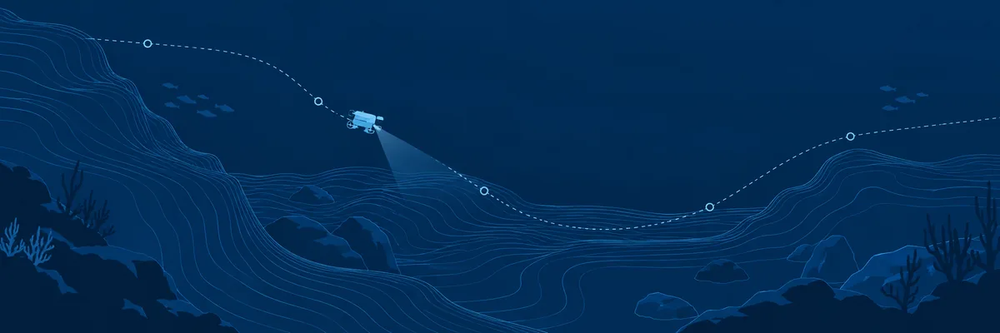
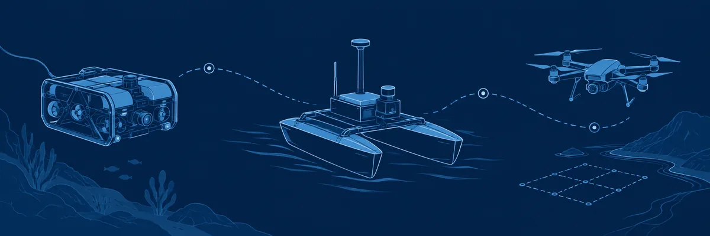

<p align="center">
  
</p>

<h1 align="center">Cockpit</h1>

<p align="center"><strong>Ground control for remote vehicles</strong></p>

<p align="center">
  <a href="https://docs.bluerobotics.com/cockpit">Live demo</a> &nbsp;·&nbsp;
  <a href="https://blueos.cloud/cockpit/docs/latest/usage/installation/">Install</a> &nbsp;·&nbsp;
  <a href="https://blueos.cloud/cockpit/docs">Documentation</a> &nbsp;·&nbsp;
  <a href="https://discuss.bluerobotics.com/c/bluerobotics-software/cockpit">Community</a>
</p>

<p align="center">
  
</p>

<p align="center">
  <a href="https://github.com/bluerobotics/cockpit/actions/workflows/ci.yml?query=branch%3Amaster"></a>
  <a href="https://github.com/bluerobotics/cockpit/releases/latest"></a>
  <a href="https://github.com/bluerobotics/cockpit/tags"></a>
</p>

<p align="center">
  <a href="https://github.com/bluerobotics/cockpit/releases"></a>
  <a href="https://hub.docker.com/r/bluerobotics/cockpit/tags"></a>
  <a href="https://deepwiki.com/bluerobotics/cockpit"></a>
</p>

<p align="center">
  <a href="#quick-start">Get started</a> &nbsp;·&nbsp;
  <a href="#browser-vs-desktop">Browser vs desktop</a> &nbsp;·&nbsp;
  <a href="#feature-overview">Features</a> &nbsp;·&nbsp;
  <a href="#current-limitations">Limitations</a> &nbsp;·&nbsp;
  <a href="#development-setup">Development</a>
</p>

---

## What is Cockpit?

Cockpit is a ground control station for piloting and monitoring remote vehicles. It runs in a browser or as a desktop application, with configurable layouts for underwater ROVs, surface boats, aerial vehicles and ground rovers.

Choose the widgets you need, arrange them around your video and map, and save separate views for different operations. Vehicle support and testing vary by autopilot and vehicle type; see [supported vehicles](#supported-vehicles) before operating.

<p align="center">
  
</p>

<p align="center"><em>Concept illustration of remote vehicle navigation, not an app screenshot</em></p>

### At a glance

| Capability                | What it provides                                                                     |
| ------------------------- | ------------------------------------------------------------------------------------ |
| Browser and desktop       | Run in a browser or install the native desktop application                           |
| Configurable layouts      | Arrange widgets and save views for different workflows                               |
| Vehicle-specific profiles | Switch between interfaces for submarines, boats, drones and rovers                   |
| Video                     | Display multiple streams, record video, take snapshots and inspect stream statistics |
| Mission planning          | Place waypoints and generate survey routes                                           |
| Joystick control          | Configure gamepad axes and button mappings                                           |
| Custom integrations       | Build DIY widgets and actions using data-lake variables and input elements           |
| Telemetry                 | Log vehicle data and display live plots and indicators                               |

---

## Quick start

### Accessing Cockpit

#### Try it online

Open the [live demo](https://docs.bluerobotics.com/cockpit) to explore the interface without installing Cockpit.

#### Install the desktop app

Download the [desktop application](https://blueos.cloud/cockpit/docs/latest/usage/installation/#self-contained-application) for your operating system and processor. The desktop version adds local file access, vehicle discovery and other system integrations listed in the [comparison table](#browser-vs-desktop).

- **Windows**: `.exe`
- **macOS (Intel)**: `x64 .dmg`
- **macOS (Apple Silicon)**: `arm64 .dmg`
- **Linux**: `.AppImage`
- **Linux (Flatpak)**: `.flatpak`, including SteamOS

#### Install the BlueOS extension

If your vehicle runs BlueOS, install Cockpit from the [Extensions page](https://blueos.cloud/docs/stable/usage/advanced/#extensions).

> The BlueOS extension runs in your browser. Some desktop integrations are unavailable in this version. See the [comparison table](#browser-vs-desktop).

#### Run with Docker

```bash
docker run -p 8080:8080 bluerobotics/cockpit:latest
```

Once Cockpit is running, configure its connection to your vehicle.

### Connecting to your vehicle

The BlueOS extension uses the address of the BlueOS connection. In the desktop app, use vehicle discovery to find BlueOS vehicles on your network. You can reopen it through **Settings > General > Search for vehicles**.

For a serial connection, such as a [USB-serial telemetry radio](https://ardupilot.org/plane/docs/common-telemetry-landingpage.html#common-telemetry-landingpage), [configure the connection address](https://blueos.cloud/cockpit/docs/latest/usage/getting-started/#general-configuration) manually. In the desktop app, open **Settings > General > MAVLink2REST URI**, enable the custom address, and enter `serial:path/to/serial/device?baudrate=desired-baudrate`. Replace the device path and baud rate with the values for your hardware, then select **Apply**.

### Streaming video

For WebRTC video without BlueOS, run [`mavlink-camera-manager`](https://github.com/mavlink/mavlink-camera-manager) on the vehicle or control station. In **Settings > General > Video connection (WebRTC)**, enable the custom address and enter the service's WebSocket URL. Use `ws://127.0.0.1:6020` only when the service runs on the same computer as Cockpit; otherwise use the service's network address. Select **Apply** to save the connection.

---

## Browser vs desktop

Both versions share Cockpit's web interface. The desktop app uses [Electron](https://www.electronjs.org/) to add integrations with local files, hardware and network services. Browser capabilities depend on the browser, its permissions and the context in which Cockpit runs.

<p>
   Available &nbsp;·&nbsp;
   Limited or requires setup &nbsp;·&nbsp;
   Not available
</p>

<div align="center">

| Feature                         |  Browser                                                                |  Desktop                                                                                           |
| ------------------------------- | ------------------------------------------------------------------------------------------------------------------------------------------- | ---------------------------------------------------------------------------------------------------------------------------------------------------------------------- |
| Joystick control                |  Requires the tab and window to stay focused                     |  Can receive joystick input while the window is in the background                         |
| Video recording                 |  Download recordings and process them in the desktop app         |  Process recordings into MP4 files and save them locally                                  |
| Snapshots                       |  Download snapshots from the library                             |  Save snapshots to local folders                                                          |
| Vehicle discovery               |  Network discovery is not available                          |  Scan your network for BlueOS vehicles                                                    |
| External serial GNSS            |  Cockpit's external GNSS integration is not available        |  Read USB or serial NMEA receivers into the data lake                                     |
| Mobile coverage heatmap         |  OpenStreetMap tower data                                        |  OpenStreetMap and OpenCellID data; OpenCellID requires your API key                      |
| Updates                         |  Update the hosted installation or BlueOS extension              |  Update checks on supported installations; Apple Silicon requires a manual release download |
| Application resource monitoring |  JavaScript memory metrics where the browser exposes them        |  Application CPU and process memory metrics                                               |
| Workspace capture               |  Full-interface capture is not available                     |  Capture the full Cockpit interface                                                       |
| AI agent access through MCP     |  No local MCP server                                         |  Local agents can create variables, actions and DIY widgets                               |
| Voice alerts                    |  Uses speech voices provided by the browser and operating system |  Bundled offline Piper voices, with system-voice fallback when unavailable                |
| Runtime and performance         | Browser runtime; performance depends on the device and workload                                                                             | Electron runtime with platform-specific builds; performance depends on the device and workload                                                                         |
| Installation                    | Open a hosted instance in a compatible browser                                                                                              | Download and install the application                                                                                                                                   |
| Platforms                       | Devices with a compatible browser                                                                                                           | Windows, macOS and Linux                                                                                                                                               |

</div>

### Which version should I use?

Use the **desktop app** when you need local recordings, background joystick input, vehicle discovery or hardware integrations.

Use the **browser version** for a quick look, a BlueOS-based setup or a device where you cannot install the desktop app.

> Start with the [live demo](https://docs.bluerobotics.com/cockpit) to explore the interface, then choose the version that supports your workflow.

---

## Supported vehicles

<p align="center">
  
</p>

<p align="center"><em>Concept illustration of remote vehicles</em></p>

Cockpit primarily supports ArduPilot-based autopilots communicating over MAVLink.

Blue Robotics develops Cockpit and regularly tests it with ArduSub and ArduRover vehicles. ROVs and boats are the project's main testing focus.

Direct control is supported for submarines and boats. Mission planning includes basic waypoints and polygon-based surveys. Advanced mission commands, such as loitering and servo control, are not covered by the basic waypoint editor.

A separate geofence editor supports polygon and circular fences. Upload and enforcement depend on the connected autopilot's capabilities. This is not a guarantee of support on every vehicle.

Aerial vehicles running ArduCopter or ArduPlane have initial support, including takeoff and landing widgets.

The project reports physical testing with ArduCopter, but aerial vehicles are not part of the primary team's regular test coverage. Validate your setup before flight and use aerial support at your own risk. Contributions to improve this coverage are welcome.

<div align="center">
  <table>
    <tr>
      <td align="center">
        <br>
        <strong>Submarines</strong><br>
        <em>ArduSub</em>
      </td>
      <td align="center">
        <br>
        <strong>Surface boats</strong><br>
        <em>ArduRover</em>
      </td>
      <td align="center">
        <br>
        <strong>Drones</strong><br>
        <em>ArduCopter</em>
      </td>
    </tr>
  </table>
</div>

---

## Feature overview

### Customizable interface

- Arrange and resize widgets with drag-and-drop controls
- Save multiple [views](https://blueos.cloud/cockpit/docs/latest/usage/advanced/#views) for different operations
- Adapt layouts to different screen sizes
- Configure colors and glass effects

### Vehicle control

- Connect to [ArduPilot](https://ardupilot.org/) vehicles, subject to the [support and testing limits](#supported-vehicles)
- Exchange vehicle commands and telemetry over [MAVLink](https://mavlink.io/en/)
- Configure [joystick controls](https://blueos.cloud/cockpit/docs/latest/usage/advanced/#joysticks), including custom controllers and button mappings
- Display live telemetry in configurable widgets

### Video streaming

- Display [WebRTC video](https://blueos.cloud/cockpit/docs/latest/usage/advanced/#webrtc-video-player) from your vehicle
- Arrange multiple streams in the same view
- [Record video](https://blueos.cloud/cockpit/docs/latest/usage/advanced/#webrtc-video-recorder), process recordings and generate telemetry overlays
- Capture snapshots with GPS metadata
- Inspect stream statistics to troubleshoot video quality

### Mission planning

- Place and move waypoints on the map
- Generate survey routes for area coverage
- Manage points of interest
- Import and export missions for backup and reuse
- Monitor and run missions on a connected vehicle
- Configure map tiles through XYZ URLs or imported ZIP, MBTiles and PMTiles archives

### Data management

- Store and retrieve variables through the [data lake](https://blueos.cloud/cockpit/docs/latest/usage/advanced/#data-lake)
- Configure [telemetry logging](https://blueos.cloud/cockpit/docs/latest/usage/advanced/#telemetry) and video overlays
- Display live [plots](https://blueos.cloud/cockpit/docs/latest/usage/advanced/#data-plotting) and [indicators](https://blueos.cloud/cockpit/docs/latest/usage/advanced/#very-generic-indicators)

### Extensibility

- Add custom widgets through the plugin system
- Use the JavaScript API for external integrations
- Call external services through HTTP actions
- Send custom commands through MAVLink actions
- Write JavaScript actions for integrations that need custom logic

---

## Available widgets

Cockpit has regular widgets for the main view and mini-widgets for smaller displays and controls. Place them in your views or in containers such as the top and bottom bars. The [interface guide](https://blueos.cloud/cockpit/docs/latest/usage/advanced/#display-breakdown) explains how these areas fit together.

Browse the [widget documentation](https://blueos.cloud/cockpit/docs/latest/usage/advanced/#widgets) for the available controls and configuration options.

---

## Advanced features

Use [Cockpit actions](https://blueos.cloud/cockpit/docs/latest/usage/advanced/#cockpit-actions-1) to run custom code, send commands or call external APIs. The [data lake](https://blueos.cloud/cockpit/docs/latest/usage/advanced/#data-lake) gives widgets and actions a shared place to read and write variables.

The linked guides cover configuration and examples for both tools.

---

## Current limitations

Check these limits before relying on Cockpit for a vehicle or mission that differs from the project's main testing focus.

### Vehicle support gaps

- **PX4 autopilots.** Cockpit uses MAVLink, but the core team does not actively test PX4 vehicles. Protocol compatibility alone does not guarantee that a feature will work with your autopilot. Report reproducible problems through the issue tracker.
- **Aerial and ground vehicles.** These vehicle types have limited support and testing compared with ROVs and boats.
- Contributions to PX4 support and broader ArduPilot vehicle coverage are welcome.

### Mission planning limitations

- The basic mission editor focuses on waypoints and surveys. Advanced mission commands, including loitering and servo control, are outside that editor's current scope.
- The geofence editor is separate from the waypoint editor. Uploads may be rejected when a vehicle does not advertise the required MAVLink service.

> Check [GitHub issues](https://github.com/bluerobotics/cockpit/issues) for known gaps and contribution opportunities.

---

## Documentation and support

- [User documentation](https://blueos.cloud/cockpit/docs) for installation, configuration and operation
- [Community forum](https://discuss.bluerobotics.com/c/bluerobotics-software/cockpit) for questions and shared setups
- [Issue tracker](https://github.com/bluerobotics/cockpit/issues) for bugs and reproducible problems
- [GitHub Discussions](https://github.com/bluerobotics/cockpit/discussions) for feature requests
- [DeepWiki](https://deepwiki.com/bluerobotics/cockpit) for automatically generated developer documentation

---

## Architecture

Cockpit shares a Vue-based interface between its browser and desktop versions.

- Vue 3, TypeScript and the Composition API for the frontend
- Vuetify 3 for Material Design components
- Vite for development and builds
- Electron for the desktop application
- WebSocket and WebRTC for vehicle data and video

---

## Contributing

Contributions can include bug reports, feature proposals, code, documentation and examples. Check existing issues and pull requests before starting work so your contribution does not duplicate an active change.

For code contributions, read the repository's [engineering instructions](AGENTS.md) and [pull request template](.github/PULL_REQUEST_TEMPLATE/pull_request_template.md). Documentation contributions should follow the conventions in the [documentation project](https://blueos.cloud/cockpit/docs).

---

## Development setup

### Prerequisites

- Node.js 22 and Yarn. The [CI workflow](.github/workflows/ci.yml) uses Node.js 22.13.0; match that version when reproducing CI behavior.
- Git with submodule support
- On Apple Silicon, CMake and `yarn build:piper` after installation to compile the offline alert voice. The build script supplies the Piper runtime for this platform; without it, development builds fall back to system voices.

### Development workflow

1. Fork the repository and clone it with its submodules
2. Create a branch for your change
3. Make the change and run the relevant checks
4. Submit a pull request using the repository's template

### Quick development start

```bash
# Clone with submodules
git clone --recurse-submodules https://github.com/bluerobotics/cockpit.git
cd cockpit

# Install dependencies
yarn install

# Start minimal development server (for testing the Lite version, in a browser)
yarn dev

# Start Electron development server (for testing the full application)
yarn dev:electron

# Fix style issues (before making a pull request)
yarn lint:fix
```

The development server uses `http://localhost:5173` by default and reloads when source files change.

> When submodule references change after a pull, update your local checkout:
>
> ```bash
> git submodule update --init --recursive
> ```

### Testing PR builds on Apple Silicon

Pull request builds are not signed by Apple, so Gatekeeper may block them. Only test a build from a source you trust. If you choose to remove the quarantine flag after installing the `.dmg`, use:

```bash
xattr -d com.apple.quarantine /Applications/Cockpit.app
```

### Backend services, optional

For WebRTC video, Cockpit uses [mavlink-camera-manager](https://github.com/mavlink/mavlink-camera-manager). [BlueOS](https://github.com/bluerobotics/blueos) includes this service. For a setup without BlueOS, install it on the vehicle or control station and configure Cockpit's video connection to reach it.

### Vehicle simulation

Use the repository's Docker Compose configuration to test with a simulated vehicle instead of physical hardware:

```bash
# Start ArduSub simulation
docker-compose -f sim.yml --profile ardusub up

# Other profiles: arducopter, ardurover, arduplane
```

---

## License

Cockpit's [license file](LICENSE.md) declares the following SPDX licensing options:

- AGPL-3.0-only
- Cockpit Custom License, available by contacting Blue Robotics

Consult LICENSE.md and Blue Robotics for the terms that apply to your use, including proprietary applications.

---

## About Blue Robotics

<div align="center">
  <picture>
    <source media="(prefers-color-scheme: dark)" srcset="src/assets/blue-robotics-white-name-logo.avif">
    
  </picture>
  <p><strong>On a mission to enable the future of marine robotics</strong></p>
  <p>
    <a href="https://bluerobotics.com">Website</a> &nbsp;·&nbsp;
    <a href="https://github.com/bluerobotics">GitHub</a> &nbsp;·&nbsp;
    <a href="https://www.youtube.com/bluerobotics">YouTube</a>
  </p>
</div>

---

<div align="center">
  <p>If Cockpit is useful to you, consider starring the repository on GitHub.</p>
  <p>Made with care by the Blue Robotics team and contributors worldwide</p>
</div>
